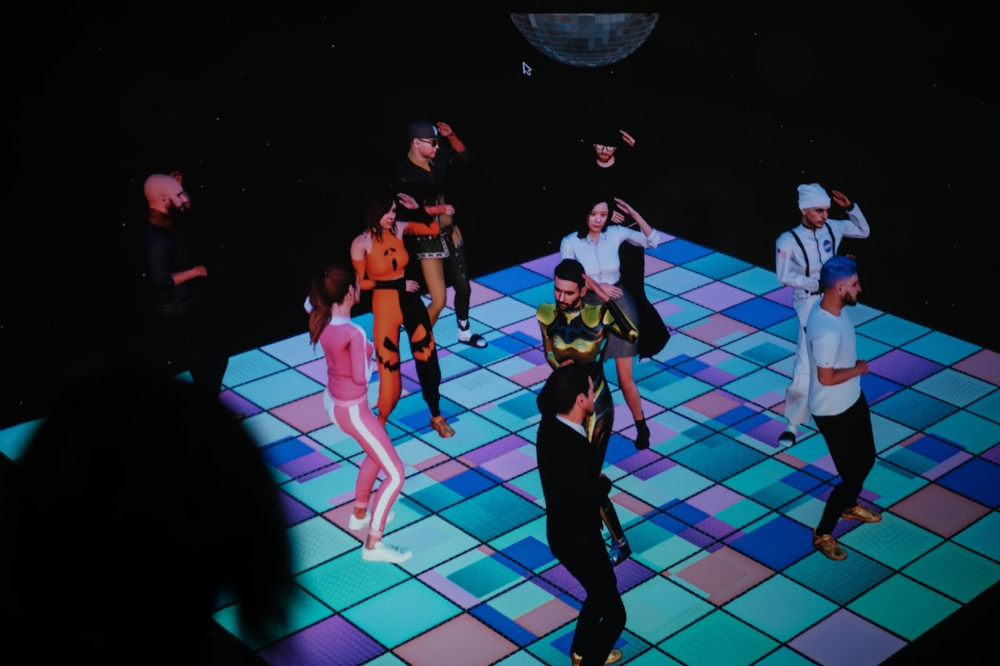
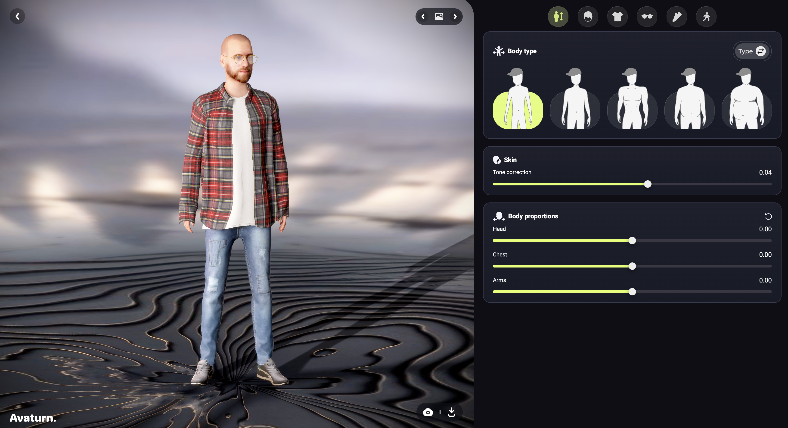
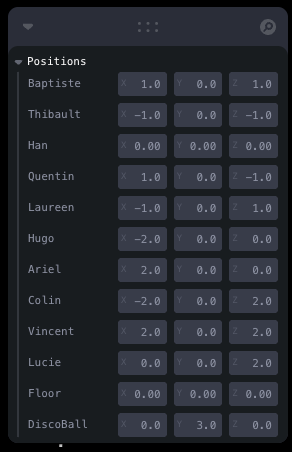
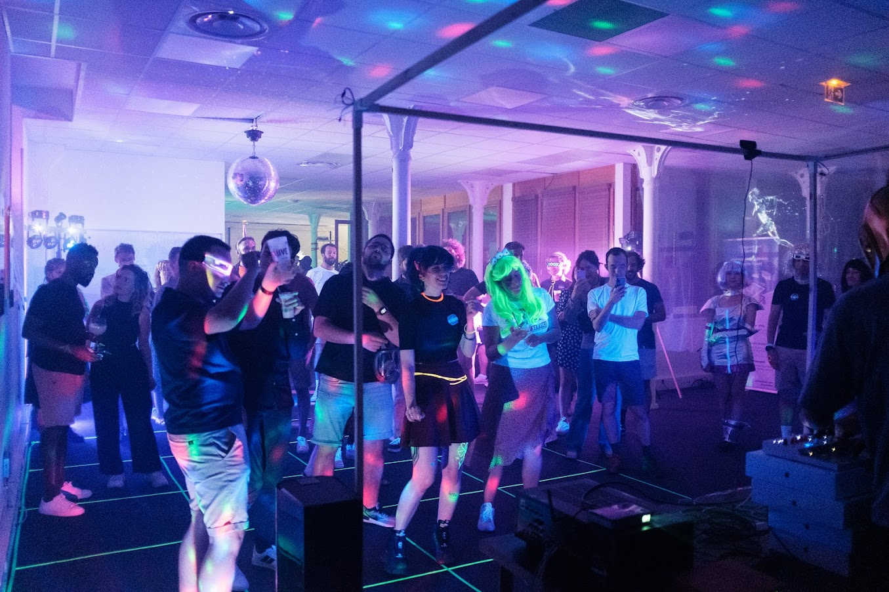

# LT : comment j'ai fait twerker mes collègues sur un dancefloor avec React



---

## Contexte

**5 ans** de Premier Octet

Grosse soirée avec plusieurs activités et ambiance

Concert des Daft Punk (les faux), Photobooth, dancefloor


---

## Recherche

- Comment **modéliser** en 3D mes collègues ?
- Comment les **animer** ?
- Comment permettre le **contrôle** des animations en temps réel ?

---

## Stack Technique

- React + [Three.js](https://threejs.org/) ([react-three/fiber](https://docs.pmnd.rs/react-three-fiber/getting-started/introduction))
- Vite
- TypeScript
- Firebase Realtime Database

---

## Modélisation

[Avaturn](https://avaturn.me) pour la création des modèles 3D

- Avatar 3D personnalisé
- Généré à partir de 3 photos
- Export en format GLB compatible Three.js



---

## Architecture React

```tsx
// App.tsx - Structure principale
<Canvas camera={{ fov: 30 }}>
  <Suspense fallback={null}>
    {MEMBERS.map((member, index) => (
      <Avatar model={member} animation={animations[member]} position={positions[member]} />
    ))}
    <Scene />
    <DiscoBall />
    <Stars />
  </Suspense>
</Canvas>
```

---

## Modélisation Three.js

```tsx
export default function Avatar({ model, animation = "silly-dancing", index, ...props }: AvatarProps) {
  const obj = useLoader(GLTFLoader, `models/${model}.glb`);
  const animationObject = useLoader(FBXLoader, `animations/${animation}.fbx`);
  const { ref, actions, names } = useAnimations(animationObject.animations);

  useEffect(() => {
    actions[names[0]]?.play();
  }, [animation]);

  return (
    <group {...props} ref={ref} rotation-y={Math.PI * index * 0.1}>
      <primitive object={obj.scene} />
    </group>
  );
}
```

---

<div class="columns">

<div>

## Animation

[Mixamo](https://www.mixamo.com) pour les animations

- Bibliothèque d'animations par Adobe
- Export FBX
- Animations fluides et naturelles
- Intégrable avec Three.js

</div>

<div>
  <video src="videos/mixamo.webm" width="100%" height="100%" autoplay muted loop></video>
</div>

</div>

---

## Contrôles

- Debug avec [Leva](https://github.com/pmndrs/leva)
- Contrôle individuel des animations
- Persistence et temps réel avec Firebase
- URL params pour customisation si nécessaire pendant la soirée

  ```
  ?dancefloor&autoRotateSpeed=0.1
  ```



---

## Gestion des animations (1/2)

```tsx
import { onValue, ref, update } from "firebase/database";
import { useControls } from "leva";

const [animations, set] = useControls("Animations", {
  Baptiste: { options: ANIMATIONS },
  Thibault: { options: ANIMATIONS },
  // ...
});
```

---

## Gestion des animations (2/2)

```tsx
import { onValue, ref, update } from "firebase/database";

// Synchronisation Firebase
useEffect(() => {
  const team = ref(database, "team");

  return onValue(team, (snapshot) => {
    const data = snapshot.val();
    if (snapshot.exists()) {
      Object.entries(data).map(([member, value]) => {
        set({ [member]: value.animation });
      });
    }
  });
}, []);
```

---

## Mise en Scène

Éléments visuels :

- Boule disco rotative, fichier 3D sur [sketchfab.com](https://sketchfab.com)

[@react-three/drei](https://github.com/pmndrs/drei) :

- Éclairage dynamique `<Stage />`
- Fond étoilé avec `<Stars />`
- Caméra orbitale avec auto-rotation `<OrbitControls />`

---

## Démo

[premieroctet.com/dancefloor](https://www.premieroctet.com/dancefloor)

---

<style scoped>
section {
  padding: 0;
  margin: 0;
}
</style>

<iframe src="https://www.premieroctet.com/dancefloor" width="100%" height="100%"></iframe>

---

<style scoped>
section {
  padding: 0;
  margin: 0;
}
</style>

<iframe src="https://premieroctet.github.io/5ans-dancefloor/#/config" width="100%" height="100%"></iframe>

---

## Merci



